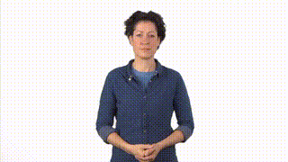
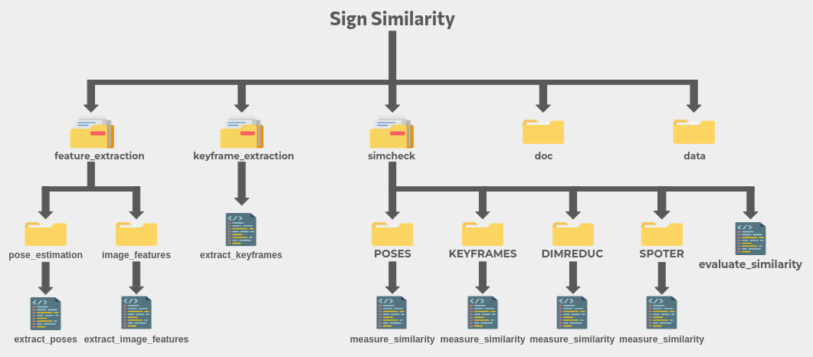

# Repository Overview

This repository documents the code and work of Kehina Manseri during her internship with the MultiSpeech team, within Inria and Loria laboratories, Université de Lorraine, France.
This work is part of [Défi Colaf](https://colaf.huma-num.fr/), financed by Plan National de Recherche en Intelligence Artificielle.

This work is documented in the publication : K Manseri, S Bigeard, S Ouni. Preprocessing MediaPipe Joint Annotation for Sign Language Similarity Analysis. SLTAT 2025 (incoming)

The goal of this repository is the study of **phonological similarity** between dictionary videos in sign languages.
It allows to find the most phonologically similar videos within a corpus of single-sign videos.

This repository features videos from several datasets for illustrative purposes. Complete credits for these videos can be found [below](#datasets-credits).

## What is similarity?

By *similarity*, we refer here to **phonological similarity**, that is, how signs can be considered visually identical.  
More precisely, using commonly accepted linguistic descriptors, two signs are considered identical if they share **all 4 manual parameters**:

- The same **handshape(s)** (configuration)
- The same **location(s)**
- The same **movement(s)**
- The same **orientation(s)**

Example of identical signs:

These signs can be described as **homonyms** since sharing the same manual parameters do not prevent them from having different meanings. 
**Non-manual parameters**, such as facial expressions or lip movements, are not considered in this work.
Finally, some variation should taken into account when identifying identical signs, as signer's signing styles might influence some parameters. For instance, the signer on the left (above) does not go as close to her shoulders using her hand the way the signer on the right does. However, both signs, based on their phonological transriptions and descriptions, are meant to be identical.

Automatically retrieving homonyms is challenging in sign language processing, as video data includes external factors such as background colors, signer morphology, and other.

During this internship, research and experiments were conducted to automatically identify homonyms in sign language corpora.  
The goal of this work is to contribute, in the long term, to the development of new features in sign language dictionaries, enabling richer linguistic analyses and corpora creation based on phonological features.

## What was done?

This work resulted in the creation of multiple packages and sub-packages stored in this repository.
Some are dedicated to **feature extraction** from videos and images, introducing methods to reduce heterogeneity across videos, while others focus on **assessing similarity** between signs based on those features.

The repository contains three main packages:

1. `feature_extraction`: for extracting keypoints from videos and embeddings from frames.
2. `keyframe_extraction` : for extracting keyframes from videos.
3. `simcheck`: for assessing similarity using various techniques and extracted features.

All methods are documented in detail both below and in the individual `README.md` files located in the root directory of each package and subpackage. These READMEs include manuals explaining how to run the scripts and how they work.

This general README aims to introduce key concepts and provide an overview of the similarity assessment pipeline, helping you better understand the detailed explanations provided in the other READMEs.

---

# Repository contents

This section presents the contents of the repository and outlines its general methodology.  
The structure, packages and subpackages are detailed below. Each package and subpackage includes a dedicated README file located in its respective directory.

## Structure

The repository contains three main packages:
 - `feature_extraction`
 - `keyframe_extraction`
 - `simcheck`

It also includes:
 - A `doc` directory for documentation and README related media/illustrations
 - A `data` directory providing samples to test different packages

## `feature_extraction`

The `feature_extraction` package is designed to extract relevant features from videos.  
👉 It contains two subpackages, described in more detail in the `feature_extraction` [README file](feature_extraction/README.md):

  - ### `pose_estimation`
    
    This subpackage extracts 2D coordinates (keypoints) of each frame in a video using the MediaPipe framework.  
    It provides tools for both initial extraction and correction to reduce potential bias.  
    Run the `extract_poses` module to use this functionality.

    👉 See [`feature_extraction/pose_estimation/README.md`](feature_extraction/pose_estimation/README.md)

  - ### `image_features`

    This subpackage extracts ViT embeddings for each frame of a video. These features are used in keyframe extraction but can also support other tasks.  
    Use the `extract_image_features` module to run this process.

    👉 See [`feature_extraction/image_features/README.md`](feature_extraction/image_features/README.md)

## `keyframe_extraction`

The `keyframe_extraction` package extracts representative keyframes from videos, those that capture the most meaningful variations and moments within each sign.  
Use the `extract_keyframes` module to perform this extraction.

👉 See [`keyframe_extraction/README.md`](keyframe_extraction/README.md)

## `simcheck`

The `simcheck` package assesses similarity between isolated sign language videos using features and representations from the `feature_extraction` and `keyframe_extraction` packages.  
It includes four subpackages, described in the main `simcheck` README and in more detail in each subpackage’s own README:

  - ### `POSES`

    This subpackage uses DTW and cosine similarity to compare videos based on keypoints extracted with the `pose_estimation` subpackage.

    👉 See [`simcheck/POSES/README.md`](simcheck/POSES/README.md)

  - ### `KEYFRAMES`

    This subpackage compares keypoints extracted only from keyframes. Keyframes are identified using the `keyframe_extraction` package, and similarity is measured using DTW and cosine similarity.

    👉 See [`simcheck/KEYFRAMES/README.md`](simcheck/KEYFRAMES/README.md)

  - ### `SPOTER`

    This subpackage uses the SPOTER Transformer architecture to produce compressed video representations from extracted keypoints. These representations can then be compared using DTW and cosine similarity. The subpackage also supports training SPOTER on your dataset.

    👉 See [`simcheck/SPOTER/README.md`](simcheck/SPOTER/README.md)

  - ### `DIMREDUC`

    This subpackage projects video representations into a 2D space and uses euclidean distance to identify nearest neighbours. It also offers visualisation of neighbours in this 2D space.

    👉 See [`simcheck/DIMREDUC/README.md`](simcheck/DIMREDUC/README.md)

### `DOC`

**TODO**

### `DATA`

**TODO**

---

# Datasets

## `WordNet`

As stated previously, **this work aims to enrich sign language dictionnaries by allowing them to connect signs based on their phonological features**.

This work was furthermore inspired by the pre-existing [WordNet Multilingual Sign Language Database.](https://www.sign-lang.uni-hamburg.de/easier/sign-wordnet/credit.html), which is a meta-dataset linking dictionary-style entries from six dictionaries covering different sign languages1 : 
**BSL SignBank** (British Sign Language, or BSL), **Noema dictionary** (Greek Sign Language, or GSL),
 **Nederlandse Gebarentaal** (Sign Language of the Netherlands, or NGT), **Svenskt teckenspråkslexikon** 
 (Swedish Sign Language, or STS), **the Corpus-based Dictionary of Polish Sign Language** 
 (Polish Sign Language, or PJM) and **GebärdensprachDatenbank** (Swiss-German Sign Language, or DSGS). 
 Combined, these datasets comprise a total of 10 321 videos. Figure 1 shows
screenshots of typical entries in these dictionaries. With the exception of Noema and Gebärdensprach-Datenbank, 
each individual
dataset includes multiple signers and a variety of backgrounds.
While some datasets provide various annotations, for example,
hand configuration, the diversity and heterogeneity of the sources
make it impossible to obtain consistent or complete phonological
annotations across the meta-dataset.

The best performing method will be used on this entire dataset, allowing the user to click on a sign to see its closest phonological matches. 

## `WLASL`

The [WLASL dataset](https://www.kaggle.com/datasets/risangbaskoro/wlasl-processed) is the largest video dataset for Word-Level American Sign Language (ASL) recognition. It features 2000 glosses distributed throughout more than 21 000 videos showing different backgrounds and signers.
It is used for the evaluation of each similarity assessment method, as well as for the training of SPOTER.

## `ASLLVD`

The `ASLLVD` dataset consists of videos (around 8000) showing more than 3000 signs in citation form. Just like for WLASL, these videos show different signers and backgrounds. This dataset is used for testing, notably to assess the performance of the preprocessing pipeline illustrated in the `feature_extraction/pose_estimation` subpackage.

## Datasets credits

- Multilingual Sign Language wordnet : Marc Schulder, Sam Bigeard, Maria Kopf, Thomas Hanke, Anna Kuder, Joanna Wójcicka, Johanna Mesch, Thomas Björkstrand, Anna Vacalopoulou, Kyriaki Vasilaki, Theodore Goulas, Stavroula-Evita Fotinea and Eleni Efthimiou. 2024. Signs and Synonymity: Continuing Development of the Multilingual Sign Language Wordnet. In Proceedings of the LREC-COLING2024 11th Workshop on the Representation and Processing of Sign Languages: Evaluation of Sign Language Resources, pages 281–291, Turin, Italy. European Language Resources Association (ELRA). URL: https://www.sign-lang.uni-hamburg.de/lrec/pub/24034.html
- Sam Bigeard, Marc Schulder, Maria Kopf, Thomas Hanke, Kiki Vasilaki, Anna Vacalopoulou, Theodoros Goulas, Athanasia-Lida Dimou, Stavroula-Evita Fotinea, and Eleni Efthimiou. 2022. Introducing Sign Languages to a Multilingual Wordnet: Bootstrapping Corpora and Lexical Resources of Greek Sign Language and German Sign Language. In Proceedings of the LREC2022 10th Workshop on the Representation and Processing of Sign Languages: Multilingual Sign Language Resources, pages 9–15, Marseille, France. European Language Resources Association (ELRA). URL: https://www.sign-lang.uni-hamburg.de/lrec/pub/22036.html

- The NOEMA+ dictionary : Eleni Efthimiou, Stavroula-Evita Fotinea, Athanasia-Lida Dimou, Theodoros Goulas, Panagiotis Karioris, Kiki Vasilaki, Anna Vacalopoulou, and Michalis Pissaris. 2016. From a sign lexical database to an SL golden corpus – the POLYTROPON SL resource. In Eleni Efthimiou, et al., editors, Proceedings of the LREC2016 7th Workshop on the Representation and Processing of Sign Languages: Corpus Mining, pages 63–68, Portorož, Slovenia. European Language Resources Association (ELRA). URL: https://www.sign-lang.uni-hamburg.de/lrec/pub/16003.pdf
- The POLYTROPON Parallel Corpus : Eleni Efthimiou, Kiki Vasilaki, Stavroula-Evita Fotinea, Anna Vacalopoulou, Theodoros Goulas, and Athanasia-Lida Dimou. 2018. The POLYTROPON parallel corpus. In Mayumi Bono et al., editors, Proceedings of the LREC2018 8th Workshop on the Representation and Processing of Sign Languages: Involving the Language Community, pages 39–44, Miyazaki, Japan. European Language Resources Association (ELRA). URL: https://www.sign-lang.uni-hamburg.de/lrec/pub/18043.pdf

- The BSL SignBank : Jordan Fenlon, Kearsy Cormier, Ramas Rentelis, Adam Schembri, Katherine Rowley, Robert Adam, and Bencie Woll. 2014. BSL SignBank: A lexical database of British Sign Language (First Edition). London: Deafness, Cognition and Language Research Centre, University College London. URL: https://bslsignbank.ucl.ac.uk/
- Nederlandse Gebarentaal via Global Signbank : Onno Crasborn, Richard Bank, Inge Zwitserlood, Els van der Kooij, Ellen Ormel, Johan Ros, Anique Schüller, Anne de Meijer, Merel van Zuilen, Yassine Ellen Nauta, Frouke van Winsum, and Max Vonk. 2020. NGT dataset in Global Signbank. Nijmegen: Radboud University, Centre for Language Studies. ISLRN: 976-021-358-388-6, DOI: 10.13140/RG.2.1.2839.1446. 
- Dictasign : Matthes S., Hanke T., Regen A., Storz J., Worseck S., Efthimiou E., Dimou A.-L., Braffort A., Glauert J. and Safar. E. 2012. Dicta-Sign – Building a Multilingual Sign Language Corpus. In Crasborn et al. (Eds.), LREC 2012, Proceedings of the 5th Workshop on the Representation and Processing of Sign Languages: Interactions between Corpus and Lexicon, Istanbul, Turkey 
- Multimedia bilingual database for the lexicon of Swiss German Sign Language 
(Lexical data courtesy of Penny Boyes Braem and University of Zurich. Video materials courtesy of University of Zurich.)
Boyes Braem, Penny. 2001. A multimedia database for the lexicon of Swiss German Sign Language. Sign Language & Linguistics. 4:1/2, 133–143. 

- WLASL dataset : Dongxu Li, Cristian Rodriguez Opazo, Xin Yu, Hongdong Li. 2020.Word-level Deep Sign Language Recognition from Video: A New Large-scale Dataset and Methods Comparison. WACV2020. https://arxiv.org/abs/1910.11006
- ASLLVD dataset : V. Athitsos, C. Neidle, S. Sclaroff, J. Nash, A. Stefan, Q. Yuan and A. Thangali, The ASL Lexicon Video Dataset, CVPR 2008 Workshop on Human Communicative Behaviour Analysis (CVPR4HB'08) https://crystal.uta.edu/~athitsos/projects/asl_lexicon/
---

# Evaluations

Given the nature of the task, evaluations can be performed in several ways.  
**This internship focused on identifying identical signs, rather than minimal pairs.** However, preliminary results suggest that further exploration of minimal pair distinctions would be valuable. We recommend annotating minimal pairs within available datasets to support automated evaluation.

**In this section, we describe the evaluation process used to assess the performance of each method. Evaluations were carried out on two datasets:**

- **`A subset of the WordNet dataset`**

  Since this work contributes to enriching this dataset, it was deemed appropriate to use some of its videos for evaluation. Groups of videos representing the same signs were manually compiled by Kehina Manseri (myself). Manual grouping may introduce bias, so I was careful to choose examples where the signs were identical across all four manual parameters (configuration, mouvement, orientation, location). Slight variations may still exist, such as signing intensity, minor location shifts, or framing differences (For instance, signing higher to remain in frame).  
  These nuances are difficult to quantify but align with the ideas in **A Prosodic Model of Sign Language Phonology** (Brentari, 1998) and feedback from Annelies Braffort. Brentari notes that phonetic and prosodic variation (due to signer style, body type, mood, etc.) should not count as phonological distinctions. I aimed to be strict, but minor deviations may occur. You are welcome to inspect this subset yourself.

- **`The full WLASL dataset`**

  This dataset contains over 21,000 signs across 2,000 glosses. Each video has, on average, 11 other videos showing the same gloss.

**The evaluation approach follows the method used in:**

- *Sign Language Recognition using Dynamic Time Warping and Hand Shape Distance Based on Histogram of Oriented Gradient Features* (Jangyodsuk et al., 2014)
- *Signing as Input for a Dictionary Query: Matching Signs Based on Joint Positions of the Dominant Hand* (Fragkiadakis et al., 2020)

**This method assesses whether the top-*k* most similar retrieved signs contain at least one correct match.**

**For example, given 10 query videos:**

|Videos|
|---|
|dsgs_VENEZUELA_1A_07794|
|sts_venezuela-09851-tecken|
|sts_montenegro-09714-tecken|
|dsgs_montenegro_1A__05772|
|2588_komunikacja|
|ngt_MONTENEGRO-4580|
|dsgs_ABEND_1A__02347|
|sts_kommunikation-11408-tecken|
|ngt_AVOND-A-1325|
|gsl_epikoinwnia-lem_3_HD|

We apply a similarity method from the `simcheck` package and retrieve the top-1 most similar video for each. The results might look like this:

|Query Video|Top-1 Match (Similarity Score)|
|---|---|
|gsl_epikoinwnia-lem_3_HD|('sts_kommunikation-11408-tecken', 19.50)|
|ngt_MONTENEGRO-4580|('dsgs_MONTENEGRO_1A__05772', 17.02)|
|dsgs_ABEND_1A__02347|('sts_kommunikation-11408-tecken', 31.63)|
|2588_komunikacja|('gsl_epikoinwnia_lem_3_HD', 21.39)|
|sts_montenegro-09714-tecken|('sts_venezuela-09851-tecken', 16.97)|
|dsgs_montenegro_1A__05772|('ngt_MONTENEGRO-4580', 17.02)|
|dsgs_VENEZUELA_1A_07794|('sts_venezuela-09851-tecken', 17.46)|
|sts_kommunikation-11408-tecken|('gsl_epikoinwnia_lem_3_HD', 19.50)|
|sts_venezuela-09851-tecken|('sts_montenegro-09714-tecken', 16.97)|
|ngt_AVOND-A-1325|('gsl_epikoinwnia_lem_3_HD', 26.17)|

In this example, 6 out of the 10 top-1 retrieved matches are correct. This yields an accuracy of 6/10 = 0.6.  
If we looked at the top-5 instead, a video would count as correctly matched if *at least one* of the top-5 results was a true match. Only one correct match in the top-*k* is required to count as a true positive.

This evaluation protocol is supported by the evaluation module `evaluate_similarity` in the package `simcheck`, (see [`simcheck/README.md`](simcheck/README.md) ) and used to generate the results presented in the final section of this README.

A more nuanced evaluation, including minimal pairs, weighting exact vs. similar matches, and computing full precision and recall scores would offer interesting insights.

# Results

This section presents all of the results obtained using the methods explained above. As mentioned earlier, evaluation is performed on the WordNet subset of identical signs and on the complete WLASL dataset.

## SPOTER

Using the SPOTER method on our datasets, to which the full preprocessing pipeline from the `feature_extraction/pose_estimation` subpackage was applied, gave the following results:

- `COSIM` : 

  | Dataset         | Top-1 | Top-5 | Top-10 | Top-20 | Top-50 |
  |-----------------|-------|-------|--------|--------|--------|
  | WordNet Subset  | 0.17  | 0.41  | 0.52   | 0.64   | 0.83   |
  | WLASL           | 0.10  | 0.25  | 0.34   | 0.44   | 0.57   |

- `DTW` : 

  | Dataset         | Top-1 | Top-5 | Top-10 | Top-20 | Top-50 |
  |-----------------|-------|-------|--------|--------|--------|
  | WordNet Subset  | 0.17  | 0.42  | 0.50   | 0.66   | 0.83   |
  | WLASL           |  TODO  |   |    |    |    |

## POSES

Directly comparing poses embeddings to measure similarity on our datasets, to which the full preprocessing pipeline from the `feature_extraction/pose_estimation` subpackage was applied, gave the following results:

- `COSIM` : 

  | Dataset         | Top-1 | Top-5 | Top-10 | Top-20 | Top-50 |
  |-----------------|-------|-------|--------|--------|--------|
  | WordNet Subset  | 0.05  | 0.12  | 0.18   | 0.25   | 0.39   |
  | WLASL           | 0.03  | 0.08  | 0.11   | 0.15   | 0.23   |

- `DTW` : 

  | Dataset         | Top-1 | Top-5 | Top-10 | Top-20 | Top-50 |
  |-----------------|-------|-------|--------|--------|--------|
  | WordNet Subset  | 0.12  | 0.22  | 0.30   | 0.40   | 0.56   |
  | WLASL           |  TODO  |   |    |    |    |
