# Pose estimation

This subpackage enables **joint annotation of body poses in videos** using the [MediaPipe Framework](https://mediapipe.readthedocs.io/en/latest/solutions/hands.html). MediaPipe detects human body landmarks in 2 or 3 dimensions. 

However, various elements can affect MediaPipe’s performance. Preprocessing these annotations can significantly improve similarity analysis.

Below is an overview of the **annotation, correction, and processing steps**. Additional comments can be found in scripts for further understanding. 

**Finally, this README includes a MANUAL section at the end, explaining in details how to run the `extract_poses` module, which will extract poses and apply all of the processing steps explained below. It will also mention the annotate_frames module, used to draw keypoints on a video for visualisation.**

- [1. Joint Annotation](#joint-annotation)
- [2. Interpolation](#interpolation)
- [3. Parasite Hand Identification](#parasite-hand-identification)
- [4. Dominant Hand Detection](#dominant-hand-detection)
- [5. Passive Arm](#passive-arm-evaluation)
- [6. Normalisation](#normalisation)
- [7. MANUAL](#manual)


## Joint Annotation

The script `landmarks.py` (in the `mediapipe` directory) extracts **coordinates of 50 body joints** per video frame:

- **Nose**
- **Neck**
- For both **left and right sides**:
  - Shoulder
  - Elbow
  - Body wrist
  - Wrist
  - Thumb: joints 1–4
  - Index to pinky: joints 1–4 each

A confidence threshold of 0.5 is applied. If this is not met, the joint coordinates are set to `0`. After detection, joint data is reordered in the following manner in x and y numpy arrays of shape `(Number of frames, 50)`.

1. `[, 0:2]` : Nose and neck 
2. `[, 2:5]` : Left body parts (Left shoulder, elbow, body wrist)
3. `[, 5:8]` : Right body parts (Right shoulder, elbow, body wrist) 
4. `[, 8:29]` : Left hand (Left wrist and 1-4 joints from thumb to pinky) 
5. `[, 29:]` : Right hand (Right wrist and 1-4 joints from thumb to pinky) 

## Interpolation

Research by Jan Zelinka and Jakub Kanis in their paper,  ["Neural Sign Language Synthesis: Words Are Our Glosses"](https://ieeexplore.ieee.org/document/9093516) has been employed to improve landmark annotations. This methodology involves using the original 2D coordinates from MediaPipe and inferring values for points that did not meet the confidence threshold to be assigned a real value. Indeed, Mediapipe sometimes struggles to assign coordinates to points in videos where:


- The hand is **side-facing** the camera
- The video has **low quality**
- Movements are **too fast**


**Before interpolation**, many coordinates may be missing:

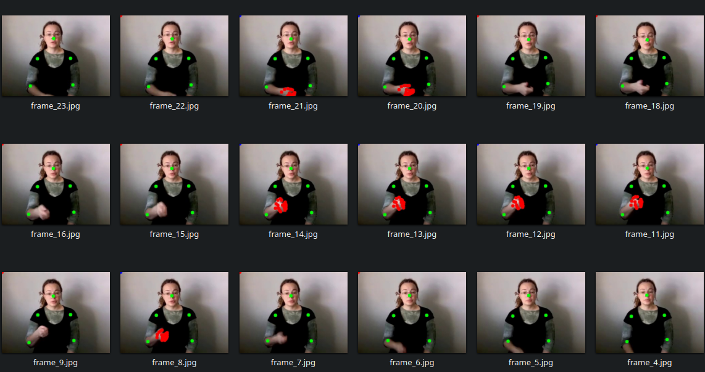

To recover them, each missing point is interpolated as a **weighted average** of the coordinates of this same point in neighbour frames, considering both coordinates and confidence.

**After interpolation**, all points are present:

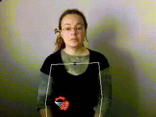

This logic is implemented in the `correct_2D_pose.py` script inside the `zelinka` directory.


## Parasite Hand Identification

MediaPipe might sometimes **mislabel** hands across frames (right hand as left or left as right). If these wrong labels occur on only a few frames, they can propagate during interpolation as they will be used by the algorithm to fill the values of the remaining frames. A hand that does not appear in the original video can therefore be annotated by MediaPipe and retained by the interpolation algorithm throughout the entire video. 

**Below is an example of how a hand, that has been identified on only a few frames originally, is now in the entire video after interpolation:**


**To address this:**

- If a hand appears in **<10% of frames**, it is considered **noise** and all of its values are set to `0`.
- After interpolation, **immobile hands** (interpolated without change) are also removed (Normally handled by the first condition).

These steps are handled in the `correct_2D_pose.py` script in the `zelinka` directory.


## Dominant Hand Detection

**In sign language, each signer has a [dominant hand](https://whatsthesign.com/signing-asl-which-hand-do-i-use/)**. In one-hand signs, the dominant hand is used. In two-hands signs, the dominant hand is used to do the most intense/fast or meaningful movement. 


Generally (as there are always exceptions):

- **Left-handed** → dominant = **left hand**
- **Right-handed** → dominant = **right hand**

In multiple papers, as in [Sign and Search: Sign Search Functionality for Sign Language Lexica](https://arxiv.org/abs/2107.13637) by Fragkiadakis and Van Der Putten, using only the dominant hand to compare signs has been revealed to be as effective as using both hands for sign similarity tasks. 

In this same paper, Fragkiadakis and Van Der Putten mention using the velocity of one's hand to identify the dominant hand, and therefore, the dominant arm.

**In attempt to effectively detect dominant hands, in our pipeline:**

- **Average velocity** is computed for each hand.
- If not conclusive, the **maximum height (y-axis)** is used as a fallback. The average velocity is a better primary condition, adding this fallback (**after** checking the velocity) improves handeness identification performances.
- This combined method yields **96.65% accuracy** over 2000 videos of the WordNet dataset.

When the **left hand is dominant**, all coordinates are **flipped** horizontally (`x' = 1 - x`). ensuring that the dominant hand is always represented on the left. The position of the left body parts and left hand are furthermore switched with the hand body parts and right hand in the final pose embedding. This way, the dominant hand and body parts are now in the left section of the system and in position `[5:8]` and `[29:]` of the pose embedding.

These steps are also in `correct_2D_pose.py`. Velocity and position analysis is done in `dominant_hand.py`, both under `zelinka`.

You can view these flipped outputs in `corpus/annotated_videos`. For example:

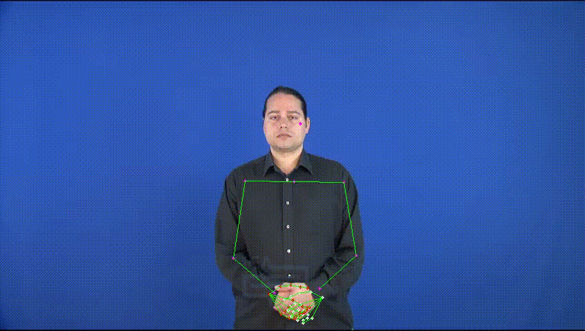


## Passive Arm Evaluation

In preliminary tests on sign similarity across videos, the behaviour of the **non-dominant (passive) arm** was shown to significantly affect results. In the WordNet dataset, passive arms **(those not involved in a one-hand sign)** often vary in position and movement based on the interpreter and the video.

**Three main behaviors have been identified:**

1. **Straight arm resting on the side of the body**  
   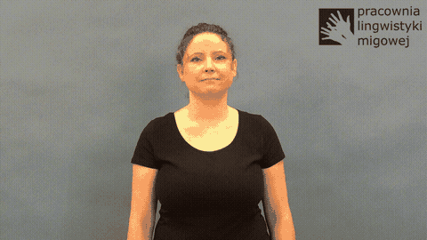

2. **Curved arm resting on the stomach**  
   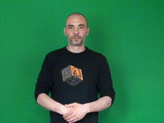

3. **Moving passive arm**  
   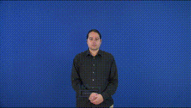
    
    > NOTE: **Moving passive arms are not yet handled.**


Two signs may incorrectly match due to similar passive arms despite the passive arm **not being part of the sign**. Therefore, we homogenised the dataset to reduce the noise caused by these arms. 

---

### 1. Evaluating the Passive Arm

Both straight and curved passive arms share a **low elbow angle variance** over time.

This angle is computed using the **cosine law**, based on distances between:
- Shoulder and Elbow
- Elbow and Body Wrist
- Body Wrist and Shoulder

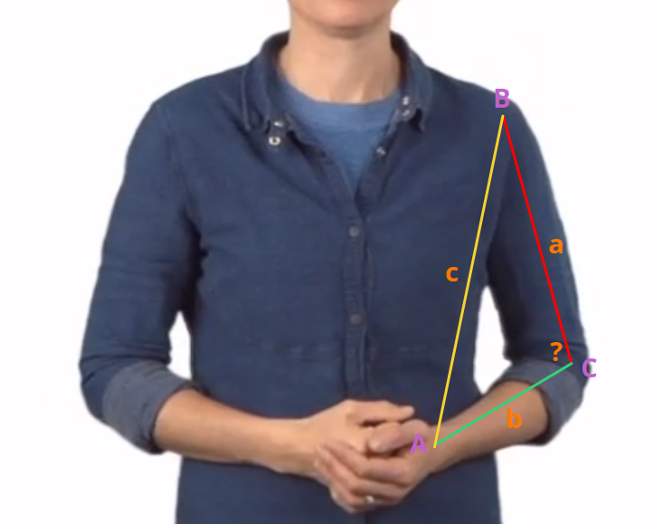

The angle ```C``` is given by:

```math
C = \arccos\left(\frac{a^2 + b^2 - c^2}{2ab}\right)
```

After evaluating 1000 videos from the WordNet dataset, **more than 99% of passive arms** had an **elbow angle variance lower than 80**.

We apply the following evaluation steps to each arm previously identified as non dominant one:

1. **If average elbow angle variance < 80:**
   - Check if the average angle is between **170° and 180°**.
     - If yes → the arm is **straight and definitely passive**.
     - If not:
       - Check if any hand joint appears **at least once** near the **side of the hip of the non dominant side**.
         - If yes → the arm is **not passive**, some active arms may have low angle variance but the hand changes positions.
         - Otherwise → the arm is confirmed to be **passive**.

We prioritise the angle based condition because the coordinates for **shoulders, elbows, and body wrists** are more stable and reliable than those of the hand joints.

---

### 2. Reconstructing the Passive Arm

Once an arm is flagged as passive, its joints are reconstructed following a consistant pattern rather than entirely being set to `0`.

- The reconstruction starts from the **neck**, used as the origin.
- Each joint is computed based on:
  - A fixed **distance** : the dominant arm's equivalent for the body parts. Arbitrary values used to divide the shoulder to shoulder distance for the hands.
  - A fixed **angle** : arbitraty values chosen to mimick a resting arm.
  - The **previous joint’s position**

The formula to convert **polar (angle + origin) to cartesian coordinates** is:

```math
x1 = x0 + distance * ({ - np.cos(angle)})
```
```math
y1 = y0 + distance * (np.sin(angle))
```

This reconstruction proceeds **joint by joint**, using each previously generated point as the new origin for the next. By doing so, the passive arm is static and consistent throughout each video and the entire dataset.

This approach avoids introducing to many `0` values and reduces noise for further similarity analyses.

**Examples of reconstruction:**

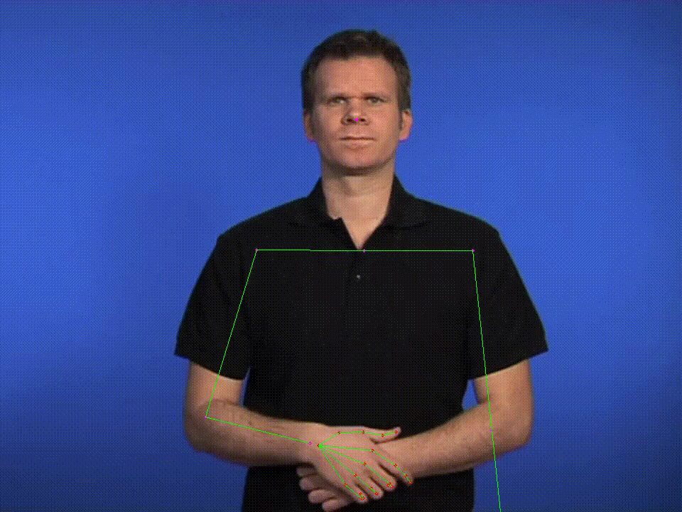
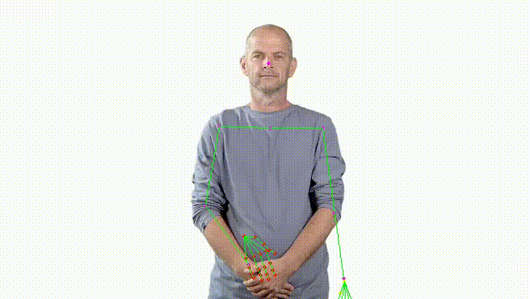

## Normalisation

If using joint coordinates allows us to ignore visual elements of the video such as skin color or clothing, it still encodes bbody proportions. Those can vary from one subject to another. An interpreter could have broader shoulders and another could be closer to the camera than most. 

To reduce this variability, we apply **2D pose normalisation**, inspired by:

- ["Preprocessing Mediapipe Keypoints with Keypoint Reconstruction and Anchors for Isolated Sign Language Recognition"](https://aclanthology.org/2024.signlang-1.36/) by Roh, Lee, Hwang, Cho and Park
- The original [Spotter Transformer paper](https://openaccess.thecvf.com/content/WACV2022W/HADCV/html/Bohacek_Sign_Pose-Based_Transformer_for_Word-Level_Sign_Language_Recognition_WACVW_2022_paper.html) by Boháček and Hrúz

### Anchor based normalisation

We define new origins for the joints to be expressed relatively.

- Body

    The **neck** becomes the origin. Each joint is therefore computed by subtracting the neck coordinates:

```math
x_k', y_k' = (x_k, y_k) - (x_{\text{neck}}, y_{\text{neck}})
```


- Hand

    Each **wrist** becomes the origin for its corresponding hand. Every hand joint is then expressed **relative to the wrist**, which removes the influence of the hand's absolute position in the frame and compared to the rest of the body.

    ```math
    x_k', y_k' = (x_k, y_k) - (x_{\text{wrist}}, y_{\text{wrist}})
    ```


  
After translating each joint relative to the neck or the wrist, differences in body size and camera distance can still result in varying joint magnitudes. For instance, the value of the body wrist joint could be higher for someone with broader shoulders and longer arms compared to someone with narrow shoulders and short arms in the same position. 

To address this, we **scale** the translated vectors using an **anchor distance** that, throughout the dataset, serves as a unit of measurement.

**For each point, the complete normalisation formula is:**

```math
x_k', y_k' = \frac{(x_k, y_k) - (x_0, y_0)}{|| (x_1, y_1) - (x_0, y_0) ||}
```
Where:

- `(x_k, y_k)` is the **current joint**.
- `(x_0, y_0)` is the **origin** (either the neck for body joints, or the wrist for hand joints).
- `(x_1, y_1)` is the **anchor point**, used to compute the denominator distance. 


This normalisation step ensures that all joint positions are not only **relative to a stable origin**, but also **scaled** by a body-proportional unit. The goal is to reduce the influence of individual body sizes and camera zoom on pose-based similarity analysis.

To select an effective anchor distance, we require that it has a low wariance accross the dataset and that it reflects overall body proportions.
There is to say that other body distances seem to vary proportionally to the variation of this anchor distance. 

In the cited paper, the authors used the **neck–nose** distance for the body, arguing that it is less variant than the shoulder–shoulder often used in sign language recognition tasks. The smaller variance of the neck-nose distance was also observed on the WordNet dataset.

| | Shoulder Shoulder | Neck Nose |
| --- | --- | --- |
| **Variance** | 0.0019 | 0.0016


Using the distance as the denominator in the normalisation formula provided some satisfying results. Poses with different absolute coordinates caused by the framing of the video were able to be scaled to very similar normalised values: 


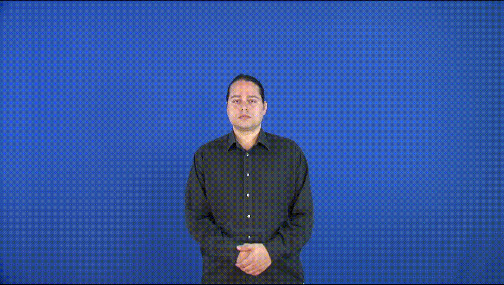
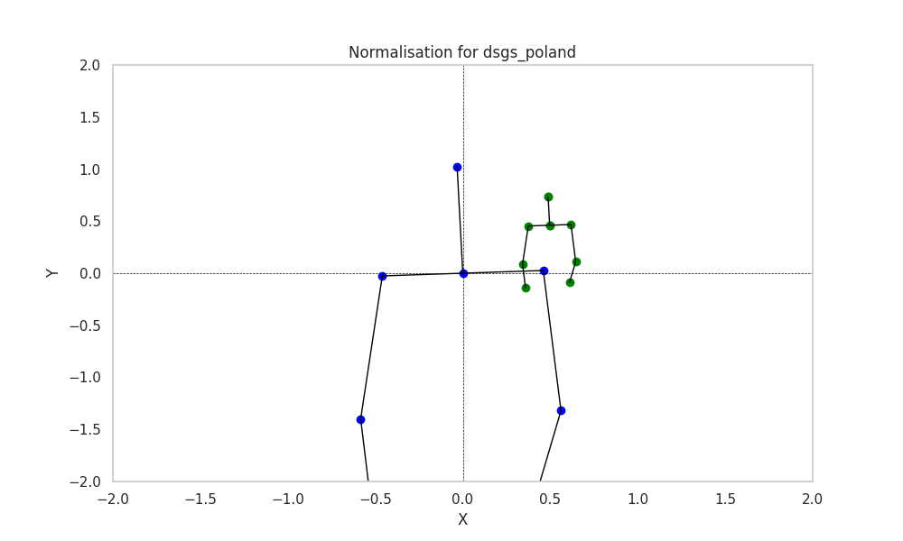
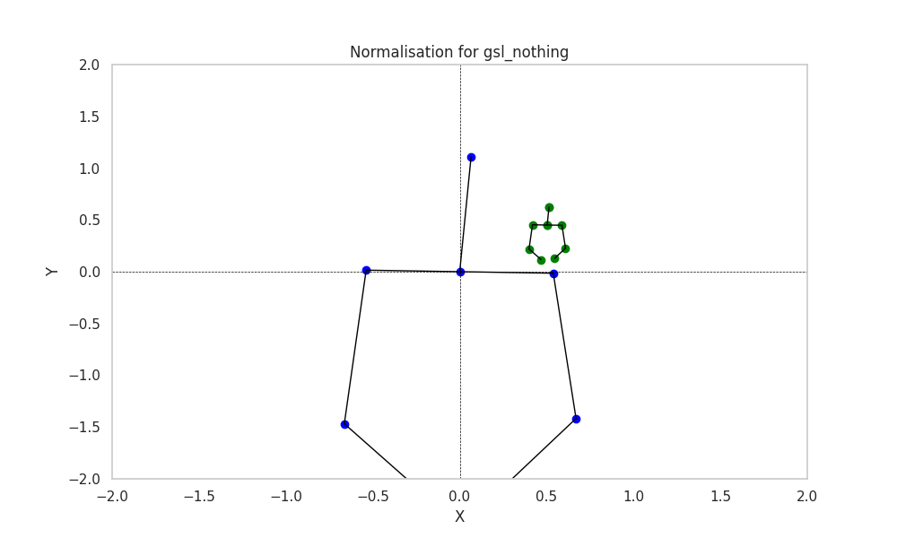

The same distance was used as the denominator for the normalisation of hands as other distances within the hands showed too much variance throughout the entire dataset: 


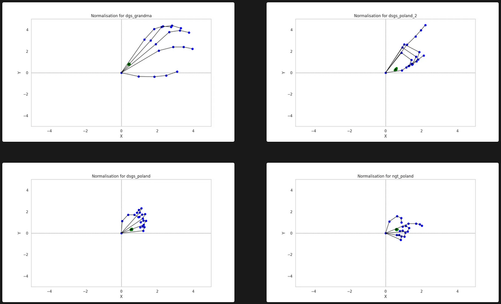

These results are less satisfying as some hands seem to appear as way bigger than the others. Some similar observations can be made on the body normalisation results.

We therefore decided to use the shoulder-shoulder distance distance as the the denominator of the normalisation formula in hope of having better results:


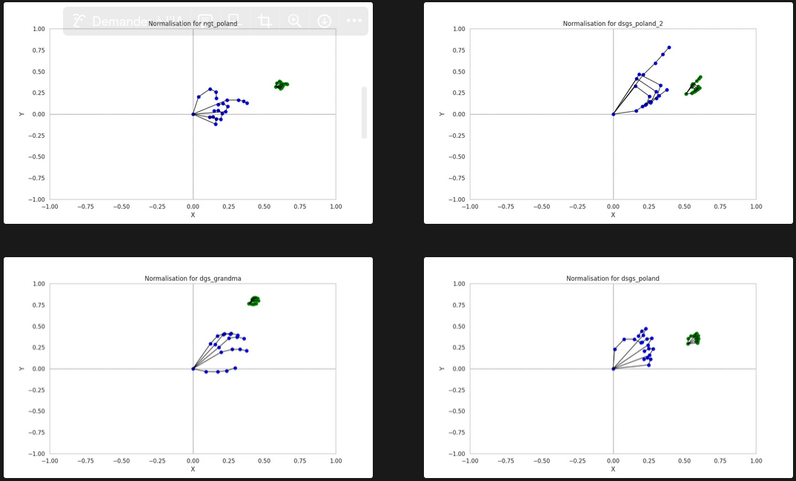

These results, seeming to be better than those obtained with the neck-nose distance, where furthermore analysed by computing the average variance of different lentghs throughout the dataset after normalisation (one with the neck-nose distance, and another with the shoulder-shoulder distance.):

| Distance | Neck Nose | Shoulder Shoulder |
| --- | --- | --- |
| **Between shoulders** | 0.03 | 0.0003 |
| **NonDomShoulder Elbow** | 0.01 | 0.03 |
| **NonDomElbow Wrist** | 0.02 | 0.03 |
| **DomShoulder Elbow** | 0.04 | 0.05 |
| **DomShoulder Wrist** | 0.05 | 0.05 |
| **NonDomWrist Thumb base** | 0.007 | 0.006 |
| **DomWrist Thumb base** | 0.001 | 0.001 | 

While both methods perform well, shoulder–shoulder, whose variance remained higher but yet very close to the neck-nose one, gives better results regarding the variance of the shoulder to shoulder distance. If logical, this result is important because this distance is taken into account for similarity analyses. Seeing how it is less variant compared to the one computed with the neck-nose variance, and how it performs similarly on other length variances, **we opted on choosing the shoulder-shoulder distance as the anchor distance used in the normalisation formula.**

### Final normalization formulas

#### For body joints:

```math
x_k', y_k' = \frac{(x_k, y_k) - (x_{\text{neck}}, y_{\text{neck}})}{||(x_{\text{right shoulder}}, y_{\text{right shoulder}}) - (x_{\text{left shoulder}}, y_{\text{left shoulder}})||}
```

#### For hands joints : 

```math
x_k', y_k' = \frac{(x_k, y_k) - (x_{\text{wrist}}, y_{\text{wrist}})}{||(x_{\text{right shoulder}}, y_{\text{right shoulder}}) - (x_{\text{left shoulder}}, y_{\text{left shoulder}})||}
```

The normalisation process can be found in the `correct_2D_pose.py` script in the `zelinka` directory. 

Normalising the data can be decided by using the `--normalize` argument while running the script. 

## **MANUAL**

The `extract_poses` module allows for the extraction of keypoints from videos. 

- **Requirements:**

  - A folder of videos saved in mp4 format, or, a single video in the same format.

- **Running:**

  The `extract_poses module` should be run from the `root_directory` (`manseri-sign-similarity`) directory. All paths should be provided relative to this directory. All keypoints will be saved in JSON files named accordingly to their corresponding videos, and stored in the directory specified as argument.


  It expects the following arguments:

  - `-vp` : path to a single video, the one from which the embeddings will be extracted.
  - `-vd` : path to a folder containing multiple videos, from which the embeddings will be extracted. 
  - `-sd` : path to the directory where the embeddings will be saved in JSON files.

  - `--normalize` : stored true argument. If provided, allows for the normalisation of the keypoints.

  - `--interpolate` : stored true argument. If provided, allows for the interpolation of missing keypoints. 

  - `-p` : to allow parallel processing.
  - `-log` : to enable logging.

  ```bash
  python3 -m feature_extraction.pose_estimation.extract_poses -vd data/WLASL/all -sd features/mediapipe/WLASL_complete -p --interpolate --normalize
---

The `annotate_frames` module allows for the annotation of videos by drawing keypoints on them. It can annotate videos processed with our pipeline or for which MediaPipe was used and its initial formatting of keypoints was preserved. The dominant hand will be represented in red. 

- **Requirements:**

  - A folder of videos saved in mp4 format.
  - A folder of JSON keypoints files extracted using the `extract_poses` module. The vidos in the video folder should all have a corresponding JSON file.

- **Running:**

  The `annotate_frames` module should be run from the `root_directory` (`manseri-sign-similarity`) directory. All paths should be provided relative to this directory. All keypoints will be saved in JSON files named accordingly to their corresponding videos, and stored in the directory specified as argument.

  It expects the following arguments:

  - `--videos_dir` : path to a folder containing multiple videos, from which poses should have been extracted. 
  - `-poses_dir` : path to a folder containing keypoints in JSON files, extracted with `extract_poses`.
  - `-sd` : path to the directory where the annotated video will be saved.

  ```bash
  python3 -m feature_extraction.pose_estimation.annotate_frames --videos_dir test --poses_dir testmediapipe --saving_dir annotated