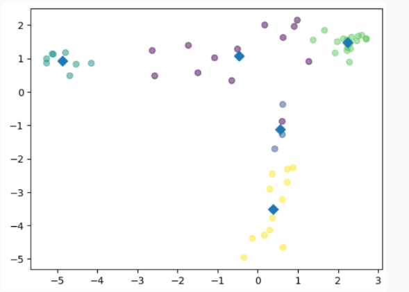
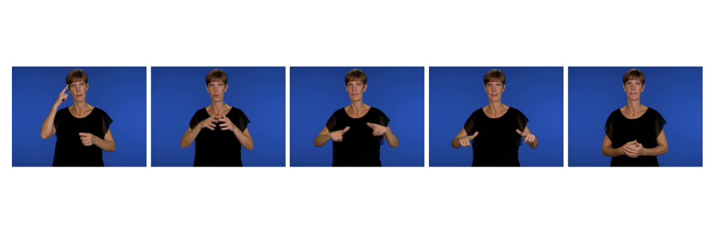

# Keyframe Extraction

This subpackage allows for the extraction of keyframes in videos using image features and KMeans clustering.

Keyframes are frames from a video that best represent its most important elements. [Various techniques](https://www.researchgate.net/publication/348169269_Keyframe_Extraction_Techniques_A_Review) exist for selecting these frames, with clustering being one effective method for identifying the most unique or representative frames in a video. Unlike methods that rely on changes in the video, such as transitions or background alterations, clustering can utilize various features, including those particularly suited for recognizing subtle changes in videos, like sign language videos where the main actions involve body and hand movements/configurations.

In the final section of this README, you'll find all requirements and explanation to run the `extract_keyframes` module.

- [1. KMeans Clustering](#kmeans-clustering)
- [2. Choosing Keyframes](#choosing-keyframes)
- [3. MANUAL](#manual)

## **KMeans clustering**

KMeans clustering begins by choosing a predetermined number of frames (datapoints) from a video, where each frame is represented by a ViT embedding. The algorithm then randomly selects initial centroids (one for each cluster) and assigns each datapoint to the nearest centroid based on Euclidean distance. After all datapoints are assigned, the centroids are recalculated as the mean of the datapoints within each cluster, and the assignment process repeats until the cluster memberships stabilize.

This clustering approach differs from simpler methods like uniform sampling, as it does not just pick frames at regular intervals but focuses on those that are most diverse, based on the features learned by the ViT model. The need to predefine the number of clusters can be addressed using the "elbow method," which helps in determining the optimal number of clusters by analyzing the variance within the clusters as a function of the number of clusters.

This method has been commented in the code as keeping a stable number of frames facilitates further processings.

## **Choosing keyframes**

After forming the clusters, selecting the keyframes involves choosing the frame closest to each cluster's centroid. This frame is considered the best representative of the cluster's characteristics. The rationale behind this selection is that the centroid represents the average or most common features within the cluster, and the frame closest to this centroid will likely be the clearest and most illustrative of these features.





For the following video : 


These frames are retrieved :



These keyframes capture essential aspects of the sign language being used, including specific hand positions and movements. Transition and resting frames frequently appear in the set of keyframes when using five clusters, suggesting that these frames are consistently identified across different videos. This consistency implies that while these frames may seem less dynamic, they provide a stable reference for comparing video similarities and minimizing noise. Trying to remove these frames might be interesting, especially for other tasks such as automatic annotation or tokenization.

# TODO 
Include explanation for visu

## **MANUAL**

Extracting keyframes is made possible by the `extract_keyframes` module.

- **Requirements:**

    - **A folder of JSON files containing ViT embeddings**:

        ViT embeddings should have been extracted from your target videos using the `extract_image_features` module in the `feature_extraction` package.
        They should all be saved in JSON files named accordingly to their corresponding videos. 

    - **OPTIONAL - A folder of JSON files containing MediaPipe extracted keypoints**:

        Using keypoints in addition to the ViT embeddings is an option. If you wish to use them, keypoints should have been extracted from your target videos using the `extract_poses` module in the `feature_extraction` package. All keypoints should have been saved in JSON files named accordingly to their corresponding videos. 

- **Running:**

    The `extract_keyframes` module should be run from the `root_directory` (`manseri-sign-similarity`) directory. All paths should be provided relative to this directory. All keyframes will be saved in folders named accordingly to their corresponding videos, and stored in the directory specified as argument.

    It expects the following arguments:

    - `-vp` : path to a single video, the one from which the keyframes will be extracted.
    - `-vd` : path to a folder containing multiple videos, from which the keyframes will be extracted. 
    - `-sd` : path to the directory where the folders with extracted keyframes will be saved.

    - `-mp` : **OPTIONAL** path to the folder containing keypoints extracted with MediaPipe. Can be used in addition to the ViT embeddings if desired.
    - `-vit` : path to the folder containing ViT embeddings for each of the target videos.

    **Make sure that `-vd`, `-mp` and `-vit` all contain the same amount of files without any mismatch.**

    `-cl` : number of clusters, will define the number of extracted keyframes.
    `-log` : to enable logging. 

    Command: 

    ```bash

    python3 -m keyframe_extraction.extract_keyframes -vd WordNet/all -vit features/ViT/WordNet -cl 5