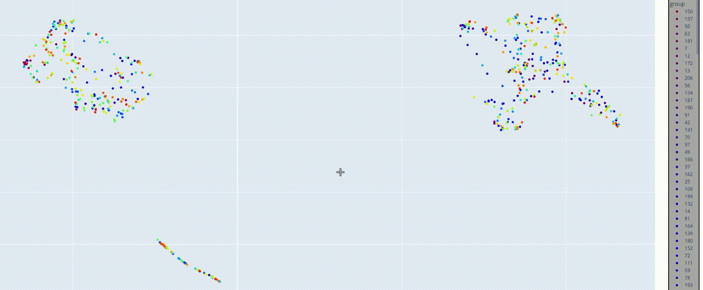

Dimensionality Reduction for phonological similarity

One of the similarity methods explored during this internship involves using **dimensionality reduction** techniques to assess sign language similarity. More precisions about these techniques and their implementation in the Algorithm, Format and MANUAL sections.

- [1. Introduction](#introduction)
- [2. Algorithm](#algorithm)
- [3. Formats](#formats)
- [4. MANUAL](#manual)
- [5. Evaluation](#evaluation)
# Introduction

Dimensionality reduction techniques allow high-dimensional data to be represented in lower-dimensional spaces. In the case of sign language processing, videos comprise two aspects:
- **Spatial**: keypoints are represented by coordinates (2D in our case) on a body that belongs to a plane.
- **Temporal**: keypoints are extracted from each frame, making the evolution of keypoints across all frames essential to represent movement.

Since we represent videos using keypoints, they are considered high-dimensional data and could therefore benefit from being projected into a smaller space.

Using dimensionality reduction to represent videos and signs has been inspired by *Signing as Input for a Dictionary Query: Matching Signs Based on Joint Positions of the Dominant Hand* (Fragkiadakis et al., 2020).

However, using dimensionality reduction techniques on our kind of data raises several questions: which algorithm should we use? How should the data be formatted? How can we then assess similarity in a 2D space?

**The approach is as follows**:

1. Provide the `measure_similarity` module with a folder of keypoints representing videos.
2. The module extracts these keypoints, keeps only the ones corresponding to the desired body part, and formats them according to the selected method.
3. These formatted keypoints are then given as input to a dimensionality reduction algorithm and projected into a 2D space.
4. Euclidean distance is computed between each pair of 2D points to assess which videos are the most similar.
5. This subpackage also provides a visualisation of its results, showing the 2D space on an interactive graph. This element is further explained below.

## Contents

- A `measure_similarity` module, used to compute similarities between videos based on their keypoint features.
- A `formatting` directory, containing scripts used in the module to correctly filter and format keypoints.
- Both `fragkiadakis` and `variance` directories, which contain scripts used in the module to specifically format and process dimensionality reduction according to the method corresponding to their name.
- A `visualisation` directory containing a script to produce visualisation files. 
- A `results` directory, used to store similarity scores, evaluation results, and visualisation files. 
- The visualisation files can be opened in any browser and look like the following screencapture:  



👉 To learn more about evaluation, check the [`simcheck/README.md`](../README.md).

# Algorithm


The chosen algorithm for dimensionality reduction is Uniform Manifold Approxixmation & Projection (UMAP) introduced in this [paper](https://arxiv.org/abs/1802.03426) and documenteed [here](https://umap-learn.readthedocs.io/en/latest/index.html). 

A very popular dimensionality reduction technique is obviously PCA, however, a general issue with PCA si that if your dataset is complex, the 2 first principal components might not be enough to represent variation and provide a relevant 2D representation of each sample. 

## Dimensionality Reduction with UMAP

The chosen algorithm for dimensionality reduction is **Uniform Manifold Approximation and Projection (UMAP)**, introduced in this [paper](https://arxiv.org/abs/1802.03426) and documented [here](https://umap-learn.readthedocs.io/en/latest/index.html).

A very popular dimensionality reduction technique is obviously PCA. However, a general issue with PCA is that if your dataset is complex, the first two principal components might not be enough to represent variation and provide a relevant 2D representation of each sample.

UMAP has a few advantages:

- Works fast and performs well on larger datasets.
- Similar samples tend to cluster together in the final output, making it useful to identify similarities and outliers.

The goal of UMAP is to create a low-dimensional graph of your data that preserves the high-dimensional clusters and their relationships to each other. The general idea is to initialise the low-dimensional points and move them until they form clusters similar to those observed in the high-dimensional data.

### 1. High-Dimensional Similarity Graph

UMAP starts by computing similarity between points in the high-dimensional space. It calculates distances between each pair of points, then constructs a graph where each point is connected to its nearest neighbors (the number of neighbors is a parameter defined by the user). The distance to each neighbor is transformed into a probability representing similarity.

### 2. Defining Local Relationships

For each point, UMAP retrieves its neighbors and computes a smooth curve (based on the distance to its nearest neighbors, with a scaling factor involving the log2 of the number of neighbors) to assign similarity scores. These values define how strongly connected each point is to its neighbors. This results in a fuzzy graph where each connection has a weight representing how close two points are in the high-dimensional space.

### 3. Low-Dimensional Embedding

UMAP then initialises a low-dimensional layout (usually randomly or with spectral embedding) and tries to optimise it. It repeatedly selects pairs of points:

- If the two points are close in the original space, it moves them closer in the low-dimensional space.
- If they are far apart in the original space, it may push them away to avoid false clusters.

This optimisation continues until the structure of the low-dimensional graph reflects the relationships from the original space as closely as possible.

In short, UMAP tries to preserve both local structure (by clustering close points) and some global structure (by maintaining relative distances between clusters).

## UMAP for sign language videos

As mentioned previously, the decision to use UMAP as a dimensionality reduction algorithm was inspired by this [paper](https://aclanthology.org/2021.mtsummit-at4ssl.3.pdf).  
In it, the authors present an inverse-search pipeline aimed at allowing users to search for a sign in a dictionary by signing it in front of a camera.

The authors propose representing signs in a 2D space using PCA and UMAP, then assessing similarity by computing the Euclidean distance between every possible pair of videos. Their experiments yielded interesting results since UMAP achieved significantly higher accuracy than PCA, and performed comparably to DTW.

They also provided results using only specific body parts as input features, which helped illustrate which components contribute most to visual similarity. Poses were represented by keypoints extracted using the OpenPose framework, and the authors described several preprocessing steps, including dominant hand identification and normalisation.
# Formats

We therefore decided to follow the authors’ pipeline in `DIMREDUC`, making sure that the formatting was the same by confirming the details with Manolis Fragkiadakis, one of the paper's authors.  
However, we also wanted to explore another formatting strategy that, in our opinion, could preserve the temporal aspect of each video more effectively.

As a result, the `DIMREDUC` subpackage allows users to format videos in two different ways:
- **fragkiadakis**: following the paper's pipeline.
- **variance**: attempting to maintain the temporal aspect.

Both methods are explained below.

## Paper format

In the previously mentioned paper, each video is represented by keypoints in arrays of shape `(num_frames, 29, 2)`, with 29 being the number of joints and 2 corresponding to the x and y coordinates.  

UMAP expects a matrix as input, where each row corresponds to one video in the dataset and each column represents a feature.

1. Each pose sequence is truncated to 86 frames. We achieve this by padding shorter videos and truncating longer ones, starting from the middle and expanding on both sides until 86 frames are reached.
2. Each array is then flattened, so that each sign is represented by a 1D array.
3. The resulting matrix contains one flattened array per row, with a total of `num_frames × 29 × 2` columns.

This matrix may lose the temporal aspect of the video, as the coordinates of the same joint at different time steps appear in different columns.
This data is then passed to the UMAP algorithm.

## Our format

We decided to try another formatting method that aims to preserve temporal information. To do this, for each video pose representation, we compute the **variance** of each joint’s position over time.

For example, this short video (with only a few joints for illustration):

| Frame | NoseX | NoseY | ThumbX | ThumbY | IndexX | IndexY |
|-------|-------|-------|--------|--------|--------|--------|
| 1     | 0.0   | 0.0   | 34.5   | -20.2  | 35.7   | -23.1  |
| 2     | 0.0   | 0.0   | 35.2   | -20.4  | 35.7   | -23.2  |
| 3     | 0.0   | 0.0   | 35.2   | -21.7  | 36.4   | -24.4  |
| 4     | 0.0   | 0.0   | 35.1   | -21.9  | 36.8   | -24.3  |
| 5     | 0.0   | 0.0   | 34.8   | -22.7  | 36.1   | -25.9  |
| 6     | 0.0   | 0.0   | 34.3   | -22.4  | 35.9   | -25.5  |

We then compute the variance of each coordinate (x and y) for every joint across all frames:

| Variance | NoseX | NoseY | ThumbX | ThumbY | IndexX | IndexY |
|----------|-------|-------|--------|--------|--------|--------|
|          | 0     | 0     | 0.147  | 1.067  | 0.188  | 1.320  |

The video becomes represented by a single 1D array of variance values.  
We repeat this process for each video in the dataset, resulting in a matrix where each row represents one video and each column corresponds to the variance of a joint’s coordinate.  
This results in a 2D matrix with `num_joints × 2` columns (100 features for 50 joints).


# MANUAL 

This section provides requirements and instructions for running the similarity scripts.

### Measure similarity

Similarity is assessed using the `measure_similarity` module located at the root of the `DIMREDUC` subpackage.

- **Requirements:**

    - **A folder containing keypoints:** 

        Keypoints should be extracted from your target videos using the `extract_poses` module in the `feature_extraction` package.


    - **OPTIONAL - A folder of GIFs:**

        The module allows the user to save an interactive visualisation of the 2D space. Generating this file is optional.  
        The folder containing these GIF files should be placed in the same directory as the output files, in the `results/visualisations` directory.  
        GIF files must be named identically to your input JSON files (except for the file extension).  
        If the GIF files do not display correctly, please check the file paths in both the resulting HTML file and the `visualisation/create_html_file.py` script.  
        Make sure you have a corresponding GIF file for each input JSON file.

    - **OPTIONAL - Groups of identical signs in a JSON file:** 
        
    
        This argument allows signs belonging to the same group (same gloss or label) to be coloured identically in the 2D plot, which can help identify clusters and trends.  
        Groups of identical signs should be stored in a JSON file of the following format.

        

        Identical signs should all be stored in dictionnaries. These files are made available for the WordNet Similarity Subset and for WLASL in the `simcheck` root directory.

- **Running the script:**

    The `measure_similarity` module must be run from the root directory (`manseri-sign-similarity`). All paths should be given relative to this directory. Results will be saved in a CSV file in the `results/similarity_measures` directory.

    The module expects the following arguments:

    - `-exp`: name of the experiment (used as the filename for the CSV and visualisation outputs)
    - `-kpd`: path to the folder containing the JSON keypoints
    - `-e`: body parts chosen by the user for comparison. Must be chosen among [`all`, `hands`, `domhand`, `wrists`, `domwrist`]. For instance, if  `domhand` is chosen, only the keypoints from the dominant hand will be used. Set to `all` by default
    - `-m`: method for input formatting. Must be chosen among [`fragkiadakis`, `variance`]
    - `-s`: stored true argument. If provided, the HTML visualisation file of the 2D space will be saved in the `results/visualisations` directory.
    - `-gold`: if saving the visualisation was decided by the user, a JSON file containing the class of each video can be provided to represent them with the same colours in the visualisation. 

    **Example command:**

    ```bash
    python3 -m simcheck.DIMREDUC.measure_similarity -exp ALL_variance -kpd WordNet/complete -e all -m variance -s -gold simcheck/video_pairs.json 

# Evaluation

*Still have to put results here!!!*


