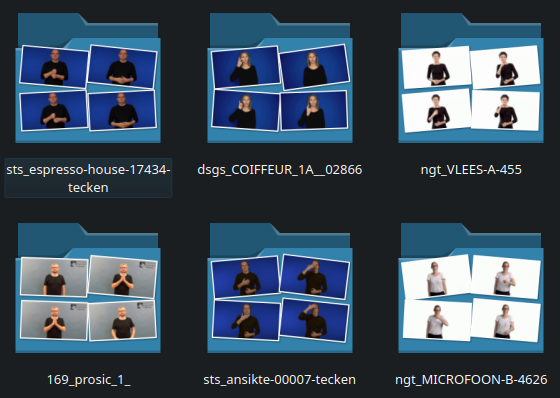

# KEYFRAMES for phonological similarity

One of the similarity methods explored during this internship involves comparing poses from keyframes to assess sign language similarity. More details about the keyframe concept and the process can be found in the sections below.

- [1. Introduction](#introduction)
- [2. Keyframes](#keyframes)
- [3. Manual](#manual)
- [4. Evaluation](#evaluation)

# Introduction

**This method consists of comparing features extracted from specific frames of each video.**  
It is inspired by previous work on sign language classification, where models often classify handshapes or signers using a single frame per sample rather than the full video.  
This README briefly summarises the keyframe extraction process and its relevance, but for full details, please refer to the `keyframe_extraction` package [README](../../keyframe_extraction/README.md).

**The approach is as follows**:

1. Provide the `measure_similarity` module with folders containing both keyframes and keypoints.
2. The module extracts keypoints from each provided keyframe. Each video is now represented only by the keypoints from its keyframes.
3. These keyframe-based pose representations are compared using DTW or cosine similarity.
4. This subpackage works similarly to the `POSES` one, except it compares a subset of frames rather than the full video. Keyframes can also be extracted in fixed numbers to allow input sequences of the same length.

## Contents

Here's a brief overview of what’s included in this subpackage (see the [Manual](#manual) for more details):

- A `measure_similarity` module, used to compute similarities between videos based on their keypoint features.
- A `results` directory, used to store similarity scores and evaluation results.

👉 To learn more about evaluation, check the [`simcheck/README.md`](../README.md).

All DTW and cosine similarity computations are implemented in the scripts located in `simcheck/computation`.

# Keyframes

Keyframes are selected frames from a video that are believed to best represent the sign. In sign language, these might be frames showing distinct hand configurations, locations, or orientations.

**Keyframe extraction process:**

1. **ViT embeddings**  
   ViT (Vision Transformer) embeddings are extracted for each frame in a video.

2. **Clustering**  
   Clustering is applied on the frame-level embeddings for each video to group visually similar frames.

3. **Keyframe selection**  
   The frame closest to each cluster centroid is selected as a keyframe.

👉 For more information on keyframe extraction, see the [`keyframe_extraction/README.md`](../../keyframe_extraction/README.md)

# Manual

This section provides requirements and instructions for running the similarity scripts.

### Measure similarity

Similarity is assessed using the `measure_similarity` module located at the root of the `KEYFRAMES` subpackage.

- **Requirements:**

    - **A folder containing subfolders of keyframes:**

      Keyframes must be extracted using the `keyframe_extraction` package. Starting from a folder of videos and their ViT embeddings, the package produces a directory of subfolders, each named after a video, containing the selected keyframes in `.jpg` format.

      

      👉 If you haven’t extracted keyframes yet, refer to the [`keyframe_extraction/README.md`](../../keyframe_extraction/README.md).

    - **A folder of JSON keypoint files:**

      Keypoints should be extracted from the same videos using the `extract_poses` module in the `feature_extraction` package.

- **Running the script:**

    The `measure_similarity` module must be run from the root directory (`manseri-sign-similarity`). All paths should be given relative to this directory. Results will be saved in a CSV file in the `results/similarity_measures` directory.

    The module expects the following arguments:

    - `-exp`: name of the experiment (used as the filename for the CSV output)
    - `-kpd`: path to the folder containing the JSON keypoints
    - `-kfd`: path to the folder containing the keyframe subfolders
    - `-m`: method used to compute similarity [`cosim` or `dtw`]

    **Example command:**
    
    ```bash
    python3 -m simcheck.keyframes.measure_similarity -kpd WordNet/complete -kfd keyframes/WordNet -m dtw -exp TEST
    ```

# Evaluation

*Still have to put results here!!!*