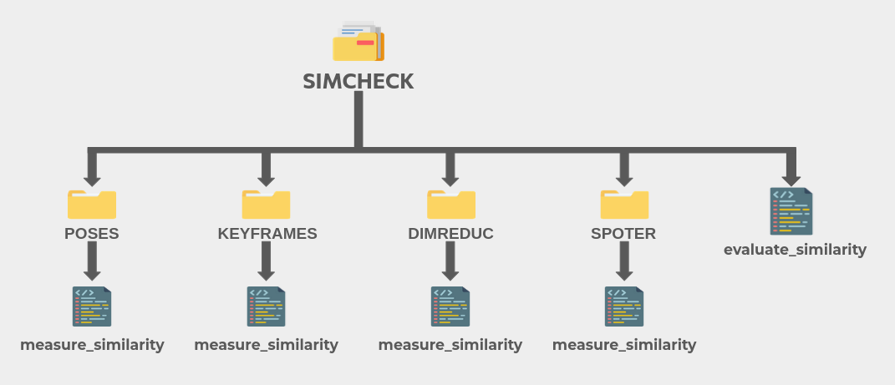
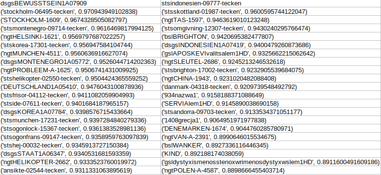
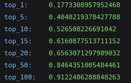

# Similarity Check

**This directory gathers several modules designed to measure phonological similarities using different approaches.**

Before computing any similarity, some preprocessing steps are required, such as extracting keypoints or keyframes from the videos to be analysed. Each method includes its own README file with detailed explanations, prerequisites, and instructions.

Below is an overview of the available techniques and how this package is structured.  
The `simcheck` package contains four subpackages: [`POSES`](POSES/README.md), [`SPOTER`](SPOTER/README.md), [`KEYFRAMES`](KEYFRAMES/README.md), and [`DIMREDUC`](DIMREDUC/README.md).


- [1. General pipeline](#general-pipeline)
- [2. Evaluating Results](#evaluating-results-optional)
- [3. MANUAL](#manual)
  - [3.1 POSES](#poses)
  - [3.2 SPOTER](#spoter)
  - [3.3 KEYFRAMES](#keyframes)
  - [3.4 DIMREDUC](#dimreduc)


## General Pipeline



**Regardless of the selected subpackage, the overall pipeline remains the same:**

1. **Prepare the required data and features**  
   (keypoints or keyframes).  
   These requirements are described in detail in each subpackage’s README.

2. **Measure similarity** using the `measure_similarity` module in each subpackage.  
   This module computes similarity scores between videos, based on the features extracted.  
   The results are saved in CSV format and stored in:  
   `{subpackage}/results/similarity_measures`

   The output CSVs are formatted in the same way across all subpackages:
   - Each **column heading** is the name of a source video.
   - Each **row** lists another video and its similarity score with the source video.
   - Only the **100 closest videos** per source are listed.
   - Rows are **ordered** by closeness:
     - For **cosine similarity**, higher scores are ranked first.
     - For **DTW distance**, smaller distances are ranked first.

   

3. **Refer to each subpackage's README** for usage instructions.  
   While the output format is the same, each `measure_similarity` script has specific data operations and running instructions.  
   👉 Check the respective README files for details:
   - [`POSES`](POSES/README.md)
   - [`KEYFRAMES`](KEYFRAMES/README.md)
   - [`DIMREDUC`](DIMREDUC/README.md)
   - [`SPOTER`](SPOTER/README.md)


## Evaluating Results (Optional)

If you have a **gold standard**, that is, known groups of videos that show identical signs, you can evaluate the performance of each similarity method using the `evaluate_similarity` module located in the root directory of the `simcheck` package. 

**Little reminder:** the evaluation method used here is explained in the global README of this repository.

- **Requirements:**

    - **Similiarity results stored in a csv file:** similarity scores must have been computed using the `measure_similarity` script module, and saved in a csv file.

    - **Groups of identical signs in a JSON file:** to evaluate the method, actual groups must be known. Groups of identical signs should be stored in a JSON file of the following format.

      

      Identical signs should all be stored in dictionnaries. These files are made available for the WordNet Similarity Subset and for WLASL in the `simcheck` root directory.


- **Running:**

  The `evaluate_similarity` module should be run from the `root_directory` (`manseri-sign-similarity`) directory. All paths should be provided relative to this directory. The module will save the similarity scores in the `{method}/results/similarity_evaluations` directory inside of a JSON file named after the experiment name. 

  It expects the following arguments:

  - `-exp` : name of the experiment. Will be included in the name of the file containing results. 
  - `-m` : name of the method used for similarity assessment. Must choose between [`SPOTER`, `POSES`, `KEYFRAMES`, `DIMREDUC`].
  - `-cf` : path of the csv file containing similarity scores.
  - `-gold` : path of the JSON file containing actual groups of identical signs within your data. 

  Command:

    ```bash
    python3 -m simcheck.SPOTER.evaluate_similarity
    -m SPOTER
    -exp MANSERI_complete wordnet /
    -cf simcheck/SPOTER/results/similarity_measures/similarities_dtw.csv /
    -gold simcheck/gold_groups.json
  ```

The resulting JSON file will look like the following example:



So here, if we refer to the command line, using similarities computed with SPOTER and DTW on the WordNet similarity subset; 18% of signs see an identical sign as their closest similarity match. 
## MANUAL

Below, you will find general explanations for how each subpackage work and should be run. More detailed explanations are provided in the README files of each subpackage. 

## `POSES`


- `POSES` allows to directly compare keypoints extracted from videos without any other step than the ones applied in the `feature_extraction` package and the `pose_estimation` subpackage.

- Poses can be retrieve from videos using `pose_estimation` and directly used as argument using the `POSES` subpackage to assess similarity with two different metrics.

- **DTW** and **Cosinus Similarity** are both used to compare every possible of poses within a given dataset. 

- Similarity scores can be computed using the `measure_similarity` module in the `POSES` subpackage root directory.

- Here is how the module should be run using an illustrative command :

  ```bash
  python3 -m simcheck.POSES.measure_similarity -exp MANSERI_POSES_complete --poses_dir features/mediapipe/WordNet/complete -m cosim
👉 For more details on the preprocessing steps and how to run the module, see [POSES/README.md](POSES/README.md)
## `SPOTER`

- SPOTER is a Transformer architecture introduced to tackle sign language processing tasks efficiently. It takes keypoints as input and provides compressed representations of signs at different stages of the architecture.

- **These compressed representations can be used to assess similarity once they have been extracted.**

- This subpackage first allows training SPOTER on keypoints extracted from any dataset using our `pose_estimation` subpackage.

- It also enables the extraction of embeddings from any video represented by keypoints using a pre-trained model. One such model is already provided in the repository at `SPOTER/retrain_SPOTER/out-checkpoints/MANSERI_original_exp_wo_pose_100`. These embeddings serve as compressed representations of signs, one embedding is extracted for each sign using the pre-trained SPOTER model.

  ### Training SPOTER

  - Training SPOTER is made possible by the `spoter_launch.sh` script.

  - Training requires keypoints extracted using the `feature_extraction` package and formatted in a structure accepted by SPOTER (formatting scripts are included in the `SPOTER` subpackage). Your data must include labels, with each video having a corresponding label, as SPOTER is trained as a classification model. More information is available in the dedicated [`SPOTER/README.md`](SPOTER/README.md).

  - Training will produce the best model checkpoint, which can later be used to extract embeddings from new videos.  
    **Note:** **This step is optional, as a trained model is already available in the repository. However, training SPOTER with your own data and preprocessing remains possible.**

  - The training script should be launched from the `retrain_SPOTER` directory with:

      ```bash
      spoter_launch.sh
      ```

  - Example command from within the `spoter_launch.sh` script:

      ```bash
      python -m train --experiment_name TEST \
                      --epochs 2 \
                      --training_set_path datasets/MANSERI_WLASL100_train.csv \
                      --testing_set_path datasets/MANSERI_WLASL100_test.csv \
                      --validation_set from-file \
                      --validation_set_path datasets/MANSERI_WLASL100_val.csv
      ```

  👉 For more details on the preprocessing steps and how to run the model, see [`SPOTER/README.md`](SPOTER/README.md).

  ### **Extracting Embeddings**

  - Extracting embeddings (compressed representations of a sign) is made possible using the `extract_embeddings` module.

  - The module expects a folder of JSON files containing keypoints extracted with the `feature_extraction` package. For each file, it retrieves the output of the last Transformer layer from the saved model. These embeddings are saved in a common JSON file located in `results/embeddings`, storing the ID of the original video along with its compressed representation.

  - The embeddings can then be compared using **cosine similarity** and **DTW** with the `measure_similarity` module. If you have a gold standard indicating which videos are considered similar, you can evaluate the similarity assessment using the `evaluate_similarity` module located in the root directory of `SIMCHECK`.

  - Here is how the module should be run using an illustrative command :

      ```bash
      python3 -m simcheck.SPOTER.measure_similarity \
              -exp MANSERI_original_exp_wo_pose_100 \
              -ef simcheck/SPOTER/results/embeddings.json
      ```

  👉 For more details on the modules, similarity assessments, and evaluation, see [`SPOTER/README.md`](SPOTER/README.md).


## `KEYFRAMES`

  - The `KEYFRAMES` subpackage is mostly similar to the `POSES` one. However, while `POSES` directly compare complete pose representations with one another, `KEYFRAMES` only uses specific frames' poses for comparison.

  - These keyframes are frames that aim at representing a sign the best, that is, by showcasing distinctive configurations or mouvements for instance.

  - These keyframes are extracted using the `keyframe_extraction` package. These keyframes, as well as the complete pose files extracted with `feature_extraction/pose_estimation` subpackage, are required to run `KEYFRAMES`.

  - **DTW** and **Cosinus Similarity** are both used to compare every possible of poses within a given dataset. 

  - Similarity scores can be computed using the `measure_similarity` module in the `KEYFRAMES` subpackage root directory.

  - Here is how the module should be run using an illustrative command : 

    ```bash
    python3 -m simcheck.KEYFRAMES.measure_similarity -kpd features/mediapipe/WordNet -kfd keyframes/WordNet --m dtw -exp TEST
    ```
  👉 For more details on the module, the requirements, and the keyframes, see [`KEYFRAMES/README.md`](KEYFRAMES/README.md) and [`keyframe_extraction/README.md`](../keyframe_extraction/README.md).


## DIMREDUC
- The `DIMREDUC` subpackage allows the application of dimensionality reduction to sign language poses using the UMAP algorithm.

- The poses used in the comparison methods (extracted via the `feature_extraction/pose_estimation` subpackage) are high-dimensional data. Each video is represented by an array of shape `(num_frames, 50, 2)`, where `50` is the number of joints (thumb, nose, neck...), and `2` corresponds to the spatial dimensions (`x` and `y`). Dimensionality reduction aims to represent these videos in a lower-dimensional space, such as 2D, where each video is described using a single `x` and `y` coordinate.

- `DIMREDUC` performs this by using UMAP to project each video into a 2D space. It supports two types of formatting to prepare video data as input to UMAP:  
  1. **Flattening** each video’s high-dimensional array, which loses temporal information.  
  2. **Computing the variance** of each joint over time, producing a 1D variance vector that serves as a compressed representation.  
  These formats are explained in detail in the `DIMREDUC` [README](DIMREDUC/README.md).

- Dimensionality reduction can also be applied to specific body parts only. For example, you can choose to extract and use only the dominant hand’s coordinates before applying UMAP.

- Similarities are then computed using Euclidean distance to assess which videos are closest to each other in the 2D space. These similarity scores can be computed using the `measure_similarity` module located in the root of the `DIMREDUC` subpackage.

- `DIMREDUC` also allows for the visualisation of video clusters in the resulting 2D space, as shown below:


- Here is how the module can be executed using an illustrative command:

    ```bash
    python3 -m simcheck.DIMREDUC.measure_similarity -exp TEST -kpd WordNet/complete -e all -m fragkiadakis -s
    ```

👉 For more details on the module, its requirements, and the dimensionality reduction, see [`DIMREDUC/README.md`](DIMREDUC/README.md).
