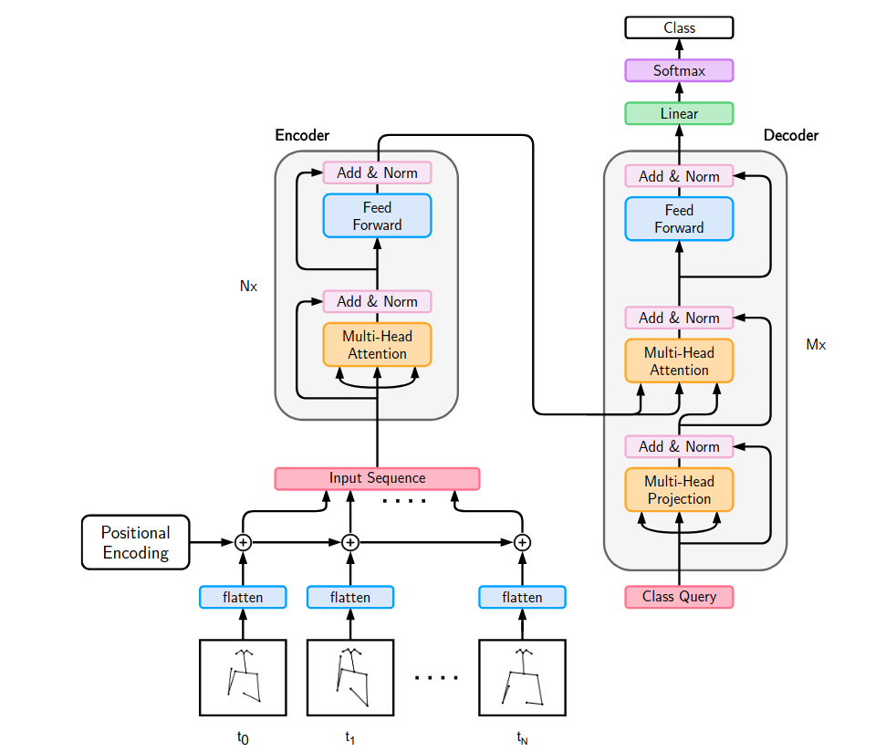
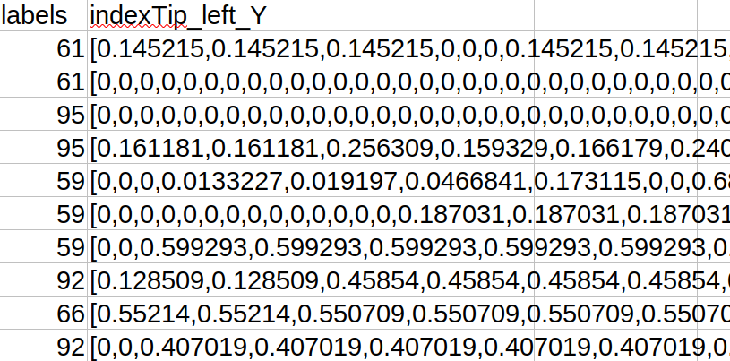
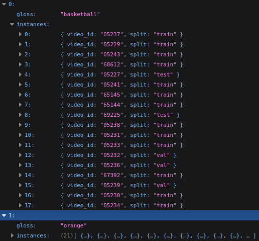
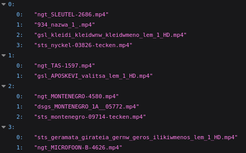

# SPOTER for phonological similarity

One of the similarity methods explored during this internship involves using **SPOTER embeddings** to assess sign language similarity. More precisions about these embeddings and the similarity analysis are provided in the Architecture and the MANUAL sections. 

- [1. Introduction](#introduction)
- [2. Architecture](#architecture)
- [2. Manual](#manual)
- [3. Evaluation](#evaluation)

# Introduction


SPOTER is a Transformer architecture originally aiming to improve performance and computation time for isolated sign language classification tasks.
While its primary focus is classification, the authors encourage broader applications of the model.

**This package proposes a pipeline for similarity assessment using SPOTER.**

**The approach is as follows:**

1. **Train SPOTER** on the WLASL dataset for classification.    Videos in this dataset are represented as **MediaPipe keypoints** stored in JSON files (to be extracted using the `feature_extraction` package in our repository).

2. **Use the best performing model** to extract embeddings from new videos (also in JSON keypoint format).

3. **Compare these embeddings** using **cosine similarity** and **DTW**.

## Contents

Here is a short breakdown of the content included in the package. More details are provided in the MANUAL section.
This subpackage includes:

### For training:

- All scripts necessary to train SPOTER and the desired data, located in the `retrain_SPOTER` directory.

- A script used to format your own keypoints in the format expected by SPOTER for training. It is located in the `formatting_poses` directory.

### For similarity assessments

- A pre-trained SPOTER model, trained on the WLASL dataset (formatted using our extraction pipeline). This model provided an accuracy of 71 on the testing set of the WLASL100 dataset. **This model can be used to extract embeddings from new videos.** It is saved in the `retrain_SPOTER/out-checkpoints` directory.

- The `extract_embeddings` script. It can be used to extract embeddings from videos using the saved SPOTER model. Example embeddings, extracted from the WordNet similarity subset, are saved in the `results/embeddings` directory. All extracted embeddings will be saved in the same directory.

- The `measure_similarity` script. It computes similarity between all saved embeddings and saves scores in a csv_file. A csv file, assessing similarity on the WordNet similarity subset, can be found in the `results/similarity_measures` directory. All csv files will be saved in the `results/similarity_measures` directory provided when running the script.

- The `evaluate_similarity` script. It evaluates the accuracy of the method by using the scores saved in the csv file. To compute these scores, a JSON file must be provided in the root of the package. This JSON file must contain the real groups of identical videos. An example is provided under the name `video_pairs.json` and concerns the WordNet similarity subset. 

**Similarity assessment can therefore be done without the training process, since a pre-saved model is already provided.** Training remains available to test other hyperparameters or to train SPOTER on other datasets to which our preprocessing pipeline was previously applied. 


# Architecture

**SPOTER** was introduced in [this paper (WACV 2022)](https://openaccess.thecvf.com/content/WACV2022W/HADCV/html/Bohacek_Sign_Pose-Based_Transformer_for_Word-Level_Sign_Language_Recognition_WACVW_2022_paper.html).  
It is a lightly modified version of the original Transformer architecture proposed in [*Attention is All You Need*](https://arxiv.org/abs/1706.03762).




- **Input format**: SPOTER takes **pose keypoints** (joint keypoints extracted using a framework, such as MediaPipe).

- **Query fector**: SPOTER uses a vector named the **Query Class**.
  - Only **Key** and **Value** are computed from the input.
  - The **Query Class** is a single learnable vector, initialised randomly.
  - This vector guides the attention mechanism and acts as a compressed representation of the sign.

- **Multi-Head Adaptation**:  
  To make SPOTER compatible with our data format and processing pipeline, we added a Multi-Attention Head.

- **Positional Embeddings**:  
  Standard positional encodings did not improve performance in our experiments, confirming experiments shown in [this paper](https://blogs.upm.es/astound/2023/10/18/interpreting-sign-language-recognition-using-transformers-and-mediapipe-landmarks/). We therefore removed it.

The embeddings extracted from new videos and used for similarity assessments have a size defined by the `Hidden_Dim` hyperparameter, which can be adjusted by the user.
These embeddings are stored in the `h` variable of the model, located in the `retrain_SPOTER/spoter` directory.

**`h` corresponds to the final output of the Transformer and represents a compressed embedding of the sign.** It results from the combination of the encoder output and the class query and serves as the input to the final linear classification layer. It is then the output of the penultimate layer of the overall model. 

**To better understand what `h` represents, we can simplify the Transformer process as follows:**

- The encoder processes sequences of joint coordinates and generates contextualised representations, capturing how joints interact and evolve based on their contexts.

- During the cross-attention stage, the decoder uses the `class query` as a recipient. It learns to extract the most relevant features from the encoder output to answer the question: “What defines the best this sign?”

- `h`, the combination of the `class query` and the encoder output, acts as a compressed latent representation. It is learned during training and encodes the most informative features of the sign into a fixed-size vector of `Hidden_Dim` values.


# MANUAL

In this section, requirements and intructions to run scripts will be provided.
Moreover, as mentioned previously, a SPOTER model is already saved and provided in this directory. If you wish to directly assess similarity, you can skip the **TRAINING** section and refer to the **EMBEDDING EXTRACTION** section.

## TRAINING

As explained previously, SPOTER can be trained using your own data.
This code provided in this repository is a modified version of the original architecture. **It aims to be used on data to which our preprocessing pipeline was applied.** We therefore invite you to extract keypoints from your data using our `feature_extraction` package and refer to its corresponding [README](../../feature_extraction/README.md).

To use SPOTER on data with other preprocessing, or with additional keypoints, we encourage you to refer to the original SPOTER repository. 

---

### **1. Formatting data**

Training SPOTER requires the input data to be formatted in a specific structure expected by the architecture.
In their original paper, the authors evaluated SPOTER on a classification task using two datasets: **LSA64** and **WLASL**.  
To allow users to directely test their model; they provided preprocessed keypoint data for **WLASL100** (a subset with 100 glosses) in the form of three CSV files, available in their repository.

Each CSV file follows this structure:

- **Columns**: Each column corresponds to a keypoint dimension (Ex: `noseX`, `noseY`, `RightShoulderX`, ...).
- **Rows**: Each row represents a single video.
- **Cells**: Each cell contains an array of values, representing the coordinates of a given keypoint across all frames of the video.   All arrays within a single row are of equal length, since they come from the same video, and therefore represent the same amount of frames.
- A dedicated **`label` column** indicates the class associated with each video.

Here is an example of the original CSV format provided by the authors:



Here, the two first rows correspond to two videos from the dataset belonging to class 61. The first  row shows this label as well as a sequence of values. These values are the coordinates of the Left Index Type (on axis Y) throughout the video. The second row shows that the left hand has not been detected in the second video from the subset.

**These files can be downloaded directly from the official [SPOTER repository](https://github.com/bohacekjakub/SPOTER).**

**We therefore had to create a script to format JSON files containing keypoints extracted with our pipeline**, so that they could be given as input to SPOTER.

### Running the formatting script

The formatting script is located in the `retrain_SPOTER/formatting_poses` directory.

- **Requirements**:

    - **A folder of JSON files**: 
        
        Keypoints must be stored in a folder.  
        These keypoints should be extracted using our `feature_extraction` package and the `extract_poses` module.

    - **A JSON file storing information about labels**: 
    
        To correctly format the keypoints, you must provide a JSON file that includes metadata for each video (its name and corresponding label). The expected structure is illustrated below:

        

        This JSON structure is derived from the original WLASL dataset. It is saved in the `retrain_SPOTER/datasets` directory.  
        If you intend to use SPOTER on your own data, you must create a similar file where:

        - Each **key** is the ID of a class (Ex: `0`, `1`, `2`, ...).
        - Each **value** is a dictionary containing:
        - `"gloss"`: the gloss label corresponding to the class.
        - `"instances"`: a list of dictionaries, each representing a video belonging to that class.  
            Each instance should include:
            - the video ID.
            - the set it belongs to (`train`, `test`, or `val`).
                
        **CSV files already containing WLASL keypoints extracted using our pipeline are available in the `retrain_SPOTER/datasets` directory. Train, test, and validation files are provided for subsets with 100, 300, and 2000 glosses.**


- **Running**:

    The script `format_poses_for_training.py` **must be run from within** the `retrain_SPOTER/formatting_poses` directory.

    It requires the following arguments:

    - `--pose_folder`: path to the folder containing the JSON files.
    - `--json_labels`: path to the label metadata file (Ex: WLASL_v0.3.json).
    - `--set`: the name of the set being formatted (`train`, `test`, or `val`).

    Command:

    ```bash
    python3 format_poses_for_training.py 
    --pose_folder ../../../WLASL \
    --json_labels ../../../../data/WLASL/WLASL_v0.3.json \
    --set test
    ```

---

### 2. Training SPOTER

Once your data has been properly formatted, you can train SPOTER using the `spoter_launch.sh` script, located in the `retrain_SPOTER` directory.

Training SPOTER will:
- Save trained models in:  
  `retrain_SPOTER/out-checkpoints/{experiment_name}`
- Generate detailed training logs including accuracy and loss metrics.
- Plots illustrating loss and accuracy evolutions in the directory `retrain_SPOTER/out-img/{experiment_name}`
 
- **Requirements:**

    - **Input data stored in csv files** :  
    You must provide three separate CSV files, one for each split: `train`, `test`, and `val`. These files must follow the format expected by SPOTER (as generated by the formatting script).

- **Running:**

    The `spoter_launch.sh` script must be run from the `retrain_SPOTER` directory.

    It expects the following **arguments**:

    - `--experiment_name`: name of the experiment (used to name output directories and logs)
    - `--epochs`: number of training epochs
    - `--training_set_path`: path to the CSV file for the training set
    - `--testing_set_path`: path to the CSV file for the test set
    - `--validation_set_path`: path to the CSV file for the validation set
    - `--validation_set`: must be set to `from-file` if using the validation set stored in the csv file

    Command: 

        
        bash spoter_launch.sh \
                    --experiment_name my_experiment \
                    --epochs 30 \
                    --training_set_path datasets/train_100.csv \
                    --testing_set_path datasets/test_100.csv \
                    --validation_set_path datasets/val_100.csv \
                    --validation_set from-file

## EMBEDDINGS EXTRACTION

To assess similarity using a saved SPOTER model, you can use three modules located directly within the root of the subpackage `SPOTER`.

### 1. Extract embeddings

Extracting embeddings is made possible by the `extract_embeddings` module.

- **Requirements:**

    - **A pre-saved SPOTER model:**

        A SPOTER model must be saved in the `retrain_SPOTER/out-checkpoints/{experiment_name}` directory. This model should be the one with the best performance recorded during testing. A pre-saved model is provided in the `retrain_SPOTER/out-checkpoints/MANSER_original_exp_wo_pose_100` directory¹.

    - **A folder of JSON files containing keypoints**:

        Keypoints should have been extracted from your target videos using our preprocessing pipeline (`extract_poses` module in the `feature_extraction` package).

- **Running:**

    The `extract_embeddings` module should be run from the `root_directory` (`manseri-sign-similarity`) directory. All paths should be provided relative to this directory. The module will save the embeddings in the `results/embeddings` directory inside of a JSON file named after the experiment name. 

    It expects the following arguments:

    - `-exp` : name of the experience. Will be the name given to the folder where the embeddings will be saved.
    - `-mp` : path of the pre-saved SPOTER model. 
    - `-kf` : path to the folder containing the extracted keypoints of your target videos.

    Command:

    ```bash
    python3 -m simcheck.SPOTER.extract_embeddings
    -exp MANSERI_original_exp_wo_pose_100 /
    -mp simcheck/SPOTER/retrain_SPOTER/out-checkpoints MANSERI_original_exp_wo_pose_100/checkpoint_t_24.pth /
    -kf features/mediapipe/WordNet

¹. This model gave an accuracy of 71 on the WLASL100 testing set (which keypoints were extracted using our preprocessing pipeline).

### 2. Measure similarity

### **add dtw section quickly ! **

Once embeddings have been extracted, similarity can be assessed using the `measure_similarity` module. 
SImilarity is computed using cosinus similarity for each possible pair of videos using their respective SPOTER embeddings. For each video, their top-100 most similar videos will be stored in a global csv file.

- **Requirements:**

    - **Saved SPOTER embeddings:**
    
    Embeddings should have been extracted from your videos using the `extract_embeddings` module, and saved in a JSON file.

- **Running:**

    The `measure_similarity` module should be run from the `root_directory` (`manseri-sign-similarity`) directory. All paths should be provided relative to this directory. The module will save the similarity scores in the `results/similarity_measures` directory inside of a csv file named after the experiment name. 

    It expects the following arguments:

    - `-exp` : name of the experience. Will be included in the name of the csv file storing the similarity scores.
    - `-ef` : path to the file containing the embeddings extracted by SPOTER and corresponding to compressed representations of each sign.
    - `-gpu` : option to use a GPU for computation. Must be specified for GPU use. 

    Command:

    ```bash
    python3 -m simcheck.SPOTER.measure_similarity
    -exp MANSERI_original_exp_wo_pose_100 /
    -ef simcheck/SPOTER/results/embeddings.json /
    - gpu

### 3. Evaluate simmilarity

Finally, this subpackage will allow you to evaluate the performance of the similarity assessment using the module `evaluate_similarity`. As mentionned above, as well as in the `README` file of the package `simcheck`, evaluating performance requires having pre-established "classes", or groups of identical signs. 

Otherwise, we advise you to refer to the final section of this README, named 'Evaluation', to see how well the SPOTER method works on different datasets and how evaluation is performed. 


- **Requirements:**

    - **Similiarity results stored in a csv file:** similarity scores must have been computed using the `measure_similarity` script module, and saved in a csv file.

    - **Groups of identical signs in a JSON file:** to evaluate the method, actual groups must be known. Groups of identical signs should be stored in a JSON file of the following format.

    

    Identical signs should all be stored in dictionnaries. These files are made available for the WordNet Similarity Subset and for WLASL in the `simcheck` root directory.


- **Running:**

    The `evaluate_similarity` module should be run from the `root_directory` (`manseri-sign-similarity`) directory. All paths should be provided relative to this directory. The module will save the similarity scores in the `results/similarity_evaluations` directory inside of a JSON file named after the experiment name. 

    It expects the following arguments:

    - `-exp` : name of the experiment. Will be included in the name of the file containing results. 
    - `-cf` : path of the csv file containing similarity scores.
    - `-gold` : path of the JSON file containing actual groups of identical signs within your data. 

    Command:

    ```bash
    python3 -m simcheck.SPOTER.evaluate_similarity
    -exp MANSERI_original_exp_wo_pose_100 /
    -cf simcheck/SPOTER/results/similarity_measures/similarities.csv /
    -gold simcheck/gold_groups.json

# Evaluation

**TO ADD results and analyses soon**
